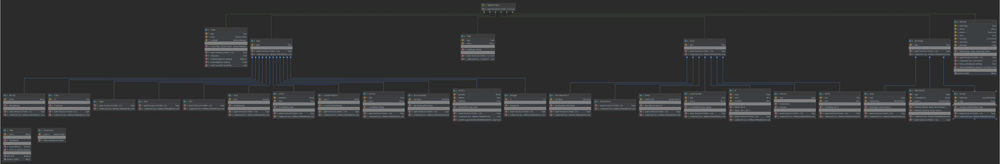

# Mini Java Compiler

## Bedienungsanleitung Java Compiler: 

Entweder:
1. Projekt klonen 
2. Im Terminal des JavaCompiler `make` aufrufen. (Testsuit wird kompiliert und ausgeführt)

Oder:
1. Release downloaden (enthählt fertigen Compiler und Testklasse)
2. Im Ordner dann `java TestRunner` ausführen 

## Kurz Doc über erledigte Aufgaben: 

- Scannen (1 Personen): Elisabeth Bürger
    - Elisabeth Bürger = Festlegen der Token und schreiben des Lexerfiles

- Parsen (3 Personen): Jannik Junker & Silas Wessely & Xuan Truong
    - Silas Wessely = Erstellen eines UML-Diagramms mit anschließender Implementierung der Klassen
    - Jannik Junker = Schreiben der Grammatik anhand der Vorgegebenen Definitionen
    - Xuan Truong   = Hinzufügen eines jay-Files auf Basis der gegebenen Grammatik und Klassen

- Semantische Analyse (2 Person): Oliver Döring & Leander Prange
    - Oliver Döring  = TypeCheck hinzugefügt, Mithilfe Bytecodegenerierung
    - Leander Prange = Mithilfe TypeCheck 

- Codeerzeugung (2 Person): Christian Schuhmann & Christian Attrot
    - Christian Schuhmann = Hinzufügen von Codegen-Methode, Implementierung, Code Documentation, Mithilfe bei TypeCheck 
    - Christian Attrot    = Testcode erzeugt, Unterstüzung bei Implementierung 

## UML-Diagramm




## Grammatik
```
S:  CLASS Type OPENCURLYBRACKET Body CLOSECURLYBRACKET 

Body: Field | Method | Field Body | Method Body

Field: Type TEXT SEMICOLON 

Method: Type TEXT OPENROUNDBRACKET Parameters CLOSEROUNDBRACKET block | Type TEXT OPENROUNDBRACKET CLOSEROUNDBRACKET block 

Parameter: Type TEXT

Parameters: Parameter COMMA Parameters | Parameter

Stmt: ifthenstatement | ifthenelsestatement | whilestatement | block | LocalVarDecl | emptystatement | returnstatement | StmtExprStmt 

statements: Stmt | statements Stmt

ifthenstatement: IF OPENROUNDBRACKET Expr CLOSEROUNDBRACKET Stmt

ifthenelsestatement: IF OPENROUNDBRACKET Expr CLOSEROUNDBRACKET Stmt ELSE Stmt

whilestatement: WHILE OPENROUNDBRACKET Expr CLOSEROUNDBRACKET Stmt

block: OPENCURLYBRACKET CLOSECURLYBRACKET | OPENCURLYBRACKET statements CLOSECURLYBRACKET 

LocalVarDecl : Type TEXT SEMICOLON

emptystatement: SEMICOLON

returnstatement: RETURN SEMICOLON | RETURN Expr SEMICOLON 

StmtExprStmt: StmtExpr SEMICOLON 

//------------------------------StmtExpr---------------------------------------
StmtExpr: Assign | New | MethodCall

Assign: LocalOrFieldVar ASSIGN Expr

New: NEW Type OPENROUNDBRACKET expressions CLOSEROUNDBRACKET | NEW Type OPENROUNDBRACKET CLOSEROUNDBRACKET

MethodCall: Expr DOT TEXT OPENROUNDBRACKET expressions CLOSEROUNDBRACKET 
    | Expr DOT TEXT OPENROUNDBRACKET CLOSEROUNDBRACKET 
    | TEXT OPENROUNDBRACKET expressions CLOSEROUNDBRACKET 
    | TEXT OPENROUNDBRACKET CLOSEROUNDBRACKET 
       
//------------------------------------Expr-----------------------------------
Expr: This | Super | LocalOrFieldVar | Unary | Binary | Integer | Bool | Char | String | Jnull | StmtExprExpr | InstVar

expressions: Expr | Expr COMMA expressions 

This: THIS

Super: SUPER 

LocalOrFieldVar: TEXT 

Unary: UNARY Expr 

Binary: Expr BINARY Expr 

Integer: INTEGER 

Bool: BOOL 

Char: CHAR

String: STRING 

Jnull: JNULL 

StmtExprExpr: StmtExpr 

InstVar: TEXT DOT Expr


//----------------------TEXT---------------------
Type: TEXT 
```